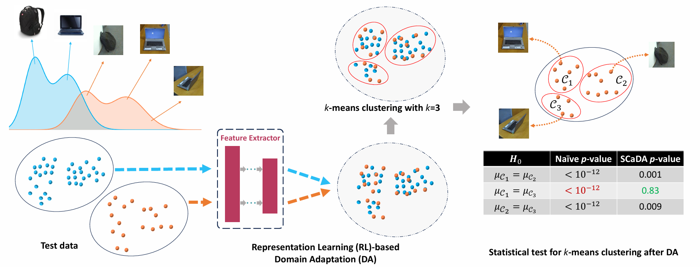
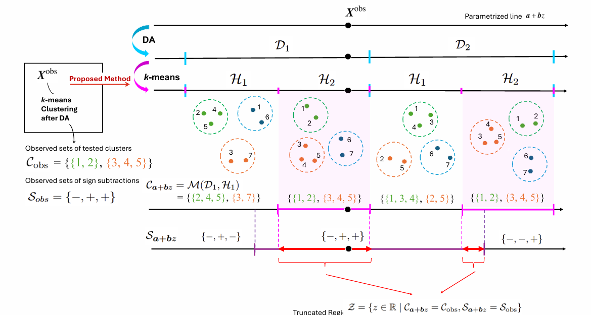

# Statistical Inference for k-means Clustering after Domain Adaptation
This package provides a statistical inference framework for k-means clustering after domain adaptation (DA). It leverages the SI framework and employs a divide-and-conquer strategy to efficiently compute the p-value of selected features. Our method ensures reliable feature selection by controlling the false positive rate (FPR) while simultaneously maximizing the true positive rate (TPR), effectively reducing the false negative rate (FNR).

## Method Overview
### SCaDA (Statistical Inference for k-means Clustering after Domain Adaptation)
Performing k-means clustering after DA can lead to erroneous clusters and misleadingly small naive p-values. SCaDA accurately distinguishes between False Positive (FP) and True Positive (TP) detections. It yields large p-values for FPs (erroneous clusters) and small p-values for TPs, correcting misleadingly small naive p-values.


*Figure 1: Illustration of the proposed SCaDA method. The source (blue) and target (orange) domains are image datasets with different marginal distributions but share two common object categories.* 

### Divide and Conquer Strategy
Proposed SCaDA method: RL-based DA and k-means clustering are followed by parameterizing the data along a test statistic to characterize the truncation region $Z$. Statistical inference is then conducted by conditioning on $Z$, using a divide-and-conquer strategy for enhanced computational tractability.


*Figure 2: Using divide-and-conquer to characterize the truncation region.*
## Environment Setup
```bash
pip install -r requirements.txt
```

## Usage
We provide several Jupyter notebooks demonstrating how to use the SCaDA.
- Example for computing _p_-values for _k_-means clustering after DA: [`ex1_compute_pvalue.ipynb`](ex1_compute_pvalue.ipynb)
- Check the uniformity of the pivot: [`ex2_validity_of_pvalue.ipynb`](ex2_validity_of_pvalue.ipynb)

## PyPI package
The `SCaDA` is available on the PyPI and can be installed as follows:
```bash
pip install scada-python
```
